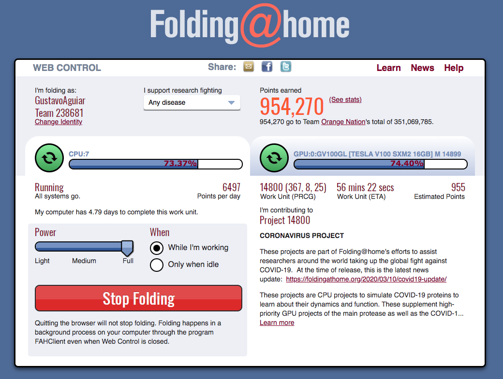

# aws-folding-at-home

## Table of Contents
- [What does it do ?](https://github.com/groorj/aws-folding-at-home#what-does-it-do)
- [This project uses](https://github.com/groorj/aws-folding-at-home#this-project-uses)
- [Get started](https://github.com/groorj/aws-folding-at-home#get-started)
- [Clean up](https://github.com/groorj/aws-folding-at-home#clean-up)
- [Notes](https://github.com/groorj/aws-folding-at-home#notes)

## What does it do

In this repo you will find some python and Terraform code to create AWS resources (VPC and EC2 instances) in order to configure and run the [Folding@Home](https://foldingathome.org/) project.

The configure python script will generate some Terraform and userdata code in order to:
- Provision AWS resources
- Create one or more EC2 instances
- Install the Folding@Home app and configure it using the information you provided

At the end of the creation, you will have a VPC with subnets and EC2 instance(s). If you choose to, you will also be able to use Athena to discover the stats URLs for each of the EC2 instances you created.

Here is the *AWS architecture* of this project:


## This project uses

- AWS VPC, IGW, EC2, Athena
- Terraform
- Amazon Linux 2 (latest)
- Python 3
- pyyaml


## Get started

### Configure the project

Use the provided `config-example.yml` as the template for your configuration.

```bash
cp config-example.yml my-config.yml
```

Edit your config file and edit the following lines:

| Parameter | Example | Notes |
| ------------- |:-------------:|:-----|
| aws_profile_name | `my-profile-name` | Your AWS [profile name](https://docs.aws.amazon.com/cli/latest/userguide/cli-configure-profiles.html). |
| aws_s3_bucket_name | `your-bucket-name` | This bucket will hold the information of instances created that will be used by Athena so you can see the Folding@Home stats for each instance. Only needed if you set `enabled_stats` to `true`. |
| aws_s3_bucket_region | `us-east-1` | Only needed if you set `enabled_stats` to `true`. |
| aws_region | `us-east-1` | The region where you want your AWS resources to run. |
| aws_availability_zone_1 | `a` | AZ 1. I recommend you do not change this parameter. |
| aws_availability_zone_2 | `b` | AZ 2. I recommend you do not change this parameter. |
| aws_instance_type | `c4.4xlarge` | Select a GPU instances. |
| aws_ec2_instance_count | `1` | Number of instances you want to create. Use with caution. |
| aws_tag_fah | `Folding@Home-AWSResourceCreator` | This is the `tag` value that will be set with the resources created. |
| fah_user | `GustavoAguiar` | Your Folding@Home username. |
| fah_pass | `my-super-complex-password` | Your Folding@Home password. |
| fah_team_id | `238681` | Your Folding@Home team id. If you don't have one you can use Orange Nation's team, which is the one I use. |
| fah_webadmin_port | `7396` | The Folding@Home web port. I recommend not chaning this unless you understand what you are doing. |
| your_ip_address | `187.63.144.1` | This is your IP that will be whitelisted to access the instances and stats. |
| enable_stats | `true` | If you wish to check the Folding@Home stats for each instance you create, set this to `true` otherwise, set `false`. |

### Install dependencies
```bash
pip3 install -r requirements.txt
```

### Run the configure script
```bash
python3 configure.py my-config.yml
```

**Result:**
```bash
AWS Profile Name:  groorj-fah
AWS Region:  us-east-1
AWS EC2 Type:  c4.4xlarge
AWS S3 Bucker Name:  your-bucket-name
Folding@Home User:  GustavoAguiar
Folding@Home Team Id:  238681
Folding@Home Pass: my-super-complex-password
Whitelist IP Address:  187.63.144.1
=====
```

This will create the terraform templates under the folder terraform/ and the userdata script under the bin/ folder. The generated files will use the values provided on the my-confif.yml file you created.

### Terraform

You will need Terraform so if you don't have it yet download from [terraform.io](https://www.terraform.io/downloads.html).

## How to use it

### Run the Terraform code
```bash
cd terraform/
terraform init
terraform plan
terraform apply
```

**Result:**
```bash
Apply complete! Resources: 20 added, 0 changed, 0 destroyed.

Outputs:

fah-instance-public-ip = [
  "18.191.90.159",
]
```

### Check the Folding@Home stats page

If you set `enable_stats` to `true` you can now access the Folding@Home EC2 instance status page by accessing the IP:PORT. Example: `http://18.191.90.159:7396/`.

Here is what the stats page looks like:

 "Folding@Home stats page"


### SSH into your instance(s)

If you provided a ssh key you can now ssh using your instance's public IP. By default no SSH key was provided so use this at your own risk.

## Clean up

- Destroy all the created AWS resources (including the Folding@Home instances):

```bash
terraform destroy
```

**Result:**
```bash
Destroy complete! Resources: 20 destroyed.
```

## Notes
Running this code will create AWS resources in your account that might not be included in the free tier.
Use this code at your own risk.
